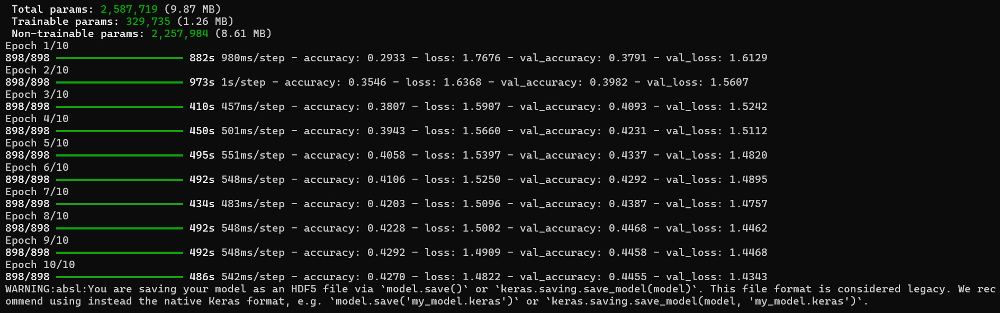

### day : Image emotion Detector(IED)

* 1. What am I building: 
>IED that takes a face image
>uses transfer Learning(MobileNetv2)
> and then classifies the emotions based on: angry ,sad,happy, fear ,disgust, surprise , neutral
> We will then use tensorflow + keras


* 2. Requirements: 
> python version: 3.8 - 3.11 
> libraries like : tensorflow ,opencv - python ,numpy , scikit-learn, matplotlib 

* 3. datset: 
> The dataset which I have used is : FER 2013 dataset --> It is the most common dataset for emotion detection 
> you can download it from kaggle --> FER2013
> It contains 2 parts i.e Train and test 
> few images are trained whereas few images which are not trained are tested. 

* 4. Algorithms Used (DETAILED)
>> 1. Convolutional Neural Networks (CNN)
CNN learns:
Edges
Shapes
Facial expressions
Core operations:
Convolution
Pooling
Feature extraction

>> 2. Transfer Learning
Instead of training from scratch:
Use pretrained weights
Add custom layers
Fine-tune for emotions
Huge advantages:
Less data required
Faster training
Higher accuracy

>> 3. Softmax Classifier
Converts raw scores to probabilities
Ensures sum = 1

>> 4. Backpropagation
Computes loss
Updates trainable weights
Uses gradient descent

>> 5. Dropout Regularization
Randomly disables neurons
Prevents memorization
Improves generalization


* Output on 1st run: 


> to explain the output we received: 
---
## 1️. What this proves 

Your project has SUCCESSFULLY :

 Loaded dataset
 Built MobileNetV2
 Froze pretrained layers
 Trained custom classifier
 Ran 10 full epochs
 Saved the model

This means the enviornment and the code is crct.

---
## 2️. Now to Understand the Model Summary
```
Total params:          2,587,719
Trainable params:      329,735
Non-trainable params:  2,257,984
```
### What this means:
                       
Total params  : Entire MobileNetV2 + your layers    
Non-trainable : Pretrained ImageNet weights (frozen)
Trainable :Only your emotion classifier  

---

## 3️. Why each epoch took so long
Example:
```
Epoch 1/10 → 882s (~14.7 minutes)
Later epochs → ~8 minutes
```

### Reasons:
* CPU training (no GPU)
* 898 batches per epoch
* Data augmentation
* Deep CNN

---
##  4️.Now to Understand the Accuracy & Loss 
### Final epoch:
```
accuracy:     0.4270  (42.7%)
val_accuracy: 0.4455  (44.5%)
loss:         1.4822
val_loss:     1.4343
```

### For reference:

Model                   Typical Accuracy

Scratch CNN                20–30%          
Transfer Learning (CPU)    40–55%          
Fine-tuned + GPU           65–75%          

---

## 5️. Most important sign: Learning trend

Look at this progression:

| Epoch | Train Acc | Val Acc |
| ----- | --------- | ------- |
| 1     | 29%       | 37%     |
| 5     | 40%       | 43%     |
| 10    | 42%       | 44%     |

 Accuracy is **increasing**
 Validation tracks training
 No overfitting

This means:

> **The model is learning real emotion features**

---

## 6️. About the warning (NOT an error)
```
WARNING: You are saving your model as an HDF5 file (.h5)
```
### Meaning:

* `.h5` format is older
* Model is still saved correctly
* Nothing is broken

### Optional improvement:
Change:

```python
model.save("emotion_detector_model.h5")
```

To:

```python
model.save("emotion_detector_model.keras")
```

That’s it.

---

##  7. How to explain this in exam / interview

> “I used MobileNetV2 with transfer learning. The pretrained ImageNet layers were frozen and a custom classifier was trained on facial emotion data. The model achieved ~45% validation accuracy, which is expected for emotion recognition on CPU without fine-tuning. Further improvements can be achieved via fine-tuning and GPU training.”


